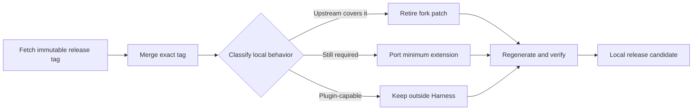

# Agent Note: Fork baseline bump to 0.1.5-alpha.1

Status: implemented

English | [中文](2026-09-09-bump-0.1.5-alpha.1.zh.md)

## Problem

The fork was based on commit `a6fec4194b67` while upstream released `dsh-v0.1.5-alpha.1` at `5dda764ed3aa`. The lines had diverged since merge base `a66e47020478`: upstream introduced Session format V3, lifetime cross-process write leases, new assistant settlement events, and broad package/document regeneration, while the fork still carried local model-effort memory, bounded hierarchical compaction, browser response fixes, MCP status observation, todo completion advice, `web:log`, scoped republish ownership, and publication tooling. Replaying every old patch would preserve code that upstream had already replaced and increase the next merge cost.

## Decision

Merge the exact release tag and classify each fork change by current behavior, not by whether an old diff still applies.

The resulting dispositions are:

| Area | Disposition on 0.1.5 | Reason |
|---|---|---|
| Session write coordination | Retire the fork `PersistenceCoordinator` and restore upstream persistence packages | Upstream `SessionWriteLease` holds POSIX flock or the Windows semaphore for the complete write-handle lifetime and closes the old check-then-append race |
| Session V3 | Adopt upstream migration unchanged | The official migration inserts `system/message`, collapses retired events, remaps local seq references, preserves predecessors, and publishes only a V3 successor |
| Basic compaction | Retain a narrow hierarchy wrapper around protected `summarize()` | Upstream still retries no first summary request that itself exceeds the summary model context; stock region selection, stability, flushing, and transaction ownership remain untouched |
| Todo completion guard | Retain and update | Read `assistant/message` and `assistant/attempt` finish chunks, consume `TodoItem` from its owning package with an explicit project reference, use `snapshotEvents()`, and document why no independent runtime invariant exists |
| Default-model effort memory | Retain and serialize the full read-compute-replace | Concurrent route writes must not lose each other; a failed write must not poison later writes |
| MCP status event | Retain with the actual shared-bus contract | `serverName` is scope-local and listener dispatch is synchronous; only synchronous observer throws can be contained |
| Browser module response | Retain scoped republish ownership and string `Content-Length` | One response serves browser and Node consumers; `HeadersInit` values must remain strings |
| Frontend static response | Retain explicit UTF-8 byte length | String bodies require `Buffer.byteLength`, while Buffer bodies use `.length`; GET and HEAD agree |
| CLI `web:log` | Retain with signal and symlink hardening | Child signals map to shell status `128 + signal`; inability to replace `web-latest.log` warns but does not block Web startup |
| Cordis and documentation catalogs | Regenerate only | They project the merged source and must not be hand-maintained fork logic |
| Release-gate reconciliation | Keep narrow script and fixture declarations | Scan canonical snapshot families instead of file-symlink aliases that break Node `fs.globSync`; declare `ui-conversation/skeleton/InputBar.tsx` as the one package-local composite assembly point already present in the release; append one replay response for old recordings that intentionally leave todos unfinished, then refresh only their V3 successors; replace the image-heavy compaction map replay with a structured checkpoint; refresh ACP expected output for the stable topology notification without changing ACP runtime |
| Fork publication selection | Diff against the immutable release ref | `--upstream-ref dsh-v0.1.5-alpha.1` chooses packages; `--base 0.1.5-alpha.1` independently asserts manifest versions |

Consumer plugins are adapted in their own repository after this source candidate is complete. They must update package versions and removed APIs, validate Host and Client halves against one runtime instance, and test copied Session fixtures in a scratch Home. This Harness change does not modify a user Profile and does not imply downgrade support; rollback restores an untouched pre-upgrade copy.

## Alternatives considered

**Replay the old fork commits onto 0.1.5.** Rejected because it would restore the weaker coordinator over the upstream lease, resurrect retired event/API shapes, and treat generated drift as product behavior.

**Drop every fork patch and solve all behavior in out-of-tree plugins.** Rejected for the default compaction overflow path: a plugin with an empty patch does not transparently replace the Provider already mounted inside shipped and user compaction realms. The other retained changes either repair a core response/CLI contract or preserve a shared service already consumed by the UI.

**Diff publication from `upstream/master`.** Rejected because a moving branch can change the package set after review. Release assembly is reproducible only when package selection and ancestry validation use the immutable release tag.

## Consequences

Future bumps repeat one reviewable sequence: fetch the release tag, merge it in an isolated branch, classify old fork behaviors against upstream, port only surviving behavior, regenerate catalogs, run focused and repository gates, then compute the publish set from the tag. A consumer may start source-linked validation before `@crazx` packages exist, but registry/frozen-install validation remains blocked until an explicitly authorized fork publish.

Verification for this adaptation includes the 167-test compaction suite with a V3 fixed-system-head regression, 486 JSONL persistence tests covering leases and V2-to-V3 publication, and focused suites for CLI logging, model effort memory, client modules, frontend static serving, MCP status, todo completion, and publication baseline selection. Repository-wide gates and the final immutable-ref package list are recorded by the release candidate commit rather than inferred in this note.
