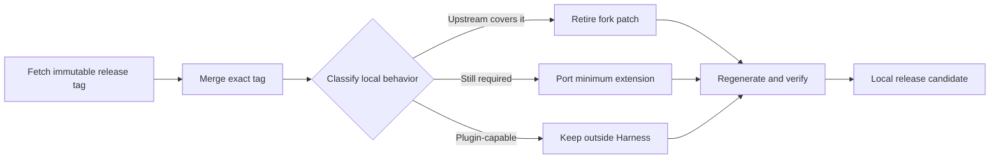

# Agent Note: Fork 基线升到 0.1.5-alpha.1

Status: implemented

[English](2026-09-09-bump-0.1.5-alpha.1.md) | 中文

## Problem

fork 基于提交 `a6fec4194b67`，上游则在 `5dda764ed3aa` 发布了 `dsh-v0.1.5-alpha.1`。双方从 merge base `a66e47020478` 起发生分叉：上游引入 Session 格式 V3、覆盖写句柄完整生命周期的跨进程 lease、新的 assistant settlement 事件，以及大范围 package/文档再生成；fork 仍携带模型推理等级记忆、有界层次压缩、浏览器响应修复、MCP 状态观察、todo 完成提醒、`web:log`、scoped 重发所有权与发布工具。重新套用每个旧补丁会保留已被上游替换的代码，并提高下次合并成本。

## Decision

合入精确 release tag，并按当前行为分类每项 fork 变更，而不是按旧 diff 能否继续应用来分类。

最终处置如下：

| 区域 | 0.1.5 上的处置 | 原因 |
|---|---|---|
| Session 写协调 | 退役 fork `PersistenceCoordinator`，把持久化包恢复为上游实现 | 上游 `SessionWriteLease` 在完整写句柄生命周期持有 POSIX flock 或 Windows semaphore，关闭旧的检查后 append 竞态 |
| Session V3 | 原样采用上游迁移 | 官方迁移插入 `system/message`、折叠退役事件、重映射本地 seq 引用、保留前代，并且只发布 V3 后继 |
| Basic compaction | 在受保护的 `summarize()` 外保留窄层 hierarchy wrapper | 上游仍不会在第一次 summary 请求本身超过 summary 模型上下文时恢复；stock 区域选择、稳定性、flush 与事务所有权保持不变 |
| Todo completion guard | 保留并更新 | 读取 `assistant/message` 与 `assistant/attempt` 的 finish chunk，通过显式 project reference 从所有者包消费 `TodoItem`，使用 `snapshotEvents()`，并说明为何不存在独立运行时不变量 |
| 默认模型 effort 记忆 | 保留并串行化完整读取、计算、替换 | 不同路由的并发写不能互相丢失；一次写失败不能污染后续写入 |
| MCP 状态事件 | 按真实共享总线契约保留 | `serverName` 只在 scope 内唯一，listener 同步分发；只能容纳同步 observer throw |
| 浏览器模块响应 | 保留 scoped 重发所有权与字符串 `Content-Length` | 同一个响应服务浏览器与 Node 消费方；`HeadersInit` 值必须保持字符串 |
| Frontend static 响应 | 保留显式 UTF-8 字节长度 | 字符串 body 使用 `Buffer.byteLength`，Buffer body 使用 `.length`；GET 与 HEAD 一致 |
| CLI `web:log` | 保留并加固信号与软链处理 | 子进程信号映射为 shell 状态 `128 + signal`；无法替换 `web-latest.log` 时只告警，不阻断 Web 启动 |
| Cordis 与文档 catalog | 只再生成 | 它们投影合并后源码，不能成为手工维护的 fork 逻辑 |
| Release gate 对账 | 保留窄脚本与 fixture 声明 | 扫描 canonical snapshot family，避开会触发 Node `fs.globSync` 错误的文件软链别名；把 release 中已经存在的 `ui-conversation/skeleton/InputBar.tsx` 声明为唯一一个包内 composite assembly point；对故意留下 unfinished todo 的旧录制追加一次 replay 响应，并且只刷新其 V3 后继；把 image-heavy compaction 的 map replay 换成结构化 checkpoint；对稳定的 ACP topology 通知刷新 expected output，不修改 ACP runtime |
| Fork 发布选包 | 对不可变 release ref 做 diff | `--upstream-ref dsh-v0.1.5-alpha.1` 负责选包；`--base 0.1.5-alpha.1` 独立断言 manifest 版本 |

消费方插件在本源码候选完成后，于自己的仓库中适配。它们必须更新包版本与已删除 API，用同一个 runtime 实例验证 Host/Client 两半，并在 scratch Home 中测试复制的 Session fixture。本次 Harness 变更不修改用户 Profile，也不意味着支持降级；回滚方式是恢复一份未动过的升级前副本。

## Alternatives considered

**把旧 fork 提交重新套到 0.1.5。** 否决，因为这会在上游 lease 之上恢复更弱的 coordinator，复活已退役的事件/API 形态，并把生成物漂移当作产品行为。

**丢掉全部 fork 补丁，把所有行为都放进出树插件。** 对默认 compaction overflow 路径否决：带空 patch 的插件不能透明替换 shipped 与 user compaction realm 中已经挂载的 Provider。其他保留项要么修复 core response/CLI 契约，要么保留 UI 已经消费的共享服务。

**从 `upstream/master` 计算发布 diff。** 否决，因为移动分支可能在审查后改变选包集合。只有选包与 ancestry 校验都使用不可变 release tag，发布组装才可重现。

## Consequences

后续 bump 重复一条可审查流程：fetch release tag，在隔离分支合入，逐项对照上游分类旧 fork 行为，只移植仍存续的行为，再生成 catalog、运行聚焦与仓库门禁，最后从 tag 计算发布集合。消费方可以在 `@crazx` 包出现前开始源码 link 验证，但 registry/frozen-install 验证在明确授权 fork 发布前必然受阻。

本次适配的验证包括：带 V3 固定 system head 回归的 167 项 compaction 测试、覆盖 lease 与 V2→V3 发布的 486 项 JSONL persistence 测试，以及 CLI 日志、模型 effort 记忆、client modules、frontend static、MCP 状态、todo 完成和发布 baseline 选择的聚焦套件。仓库级门禁与最终不可变 ref 选包清单由 release candidate 提交记录，不在本 Note 中推断。
